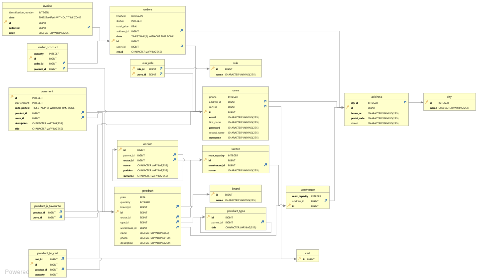
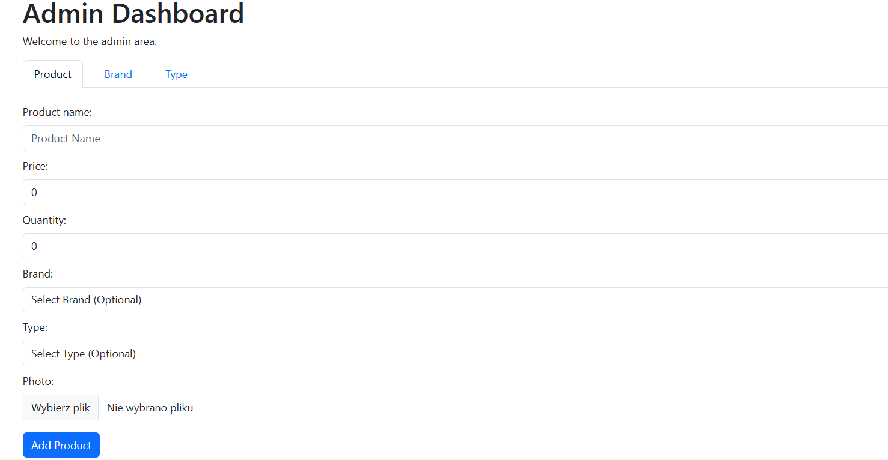
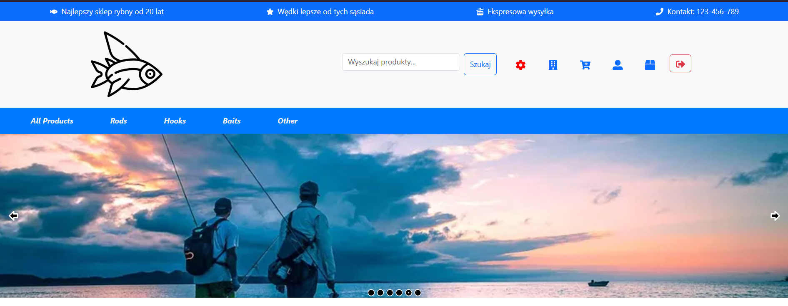
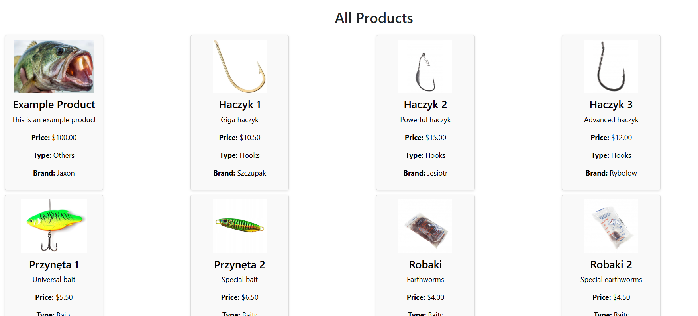
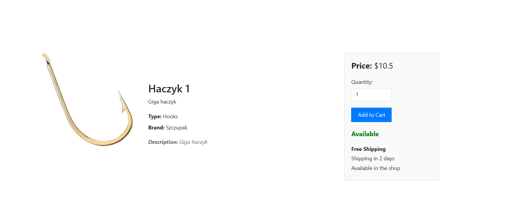
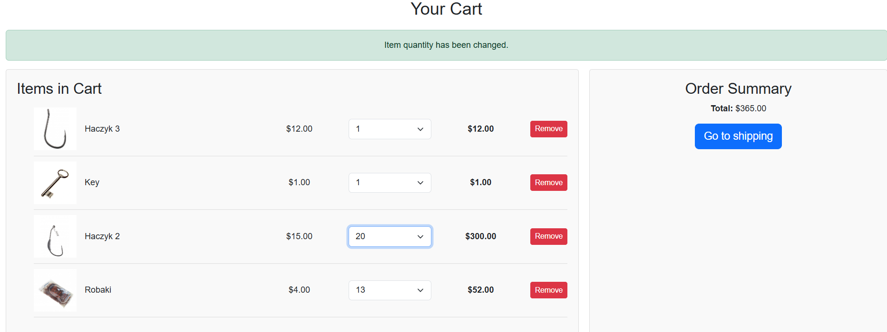
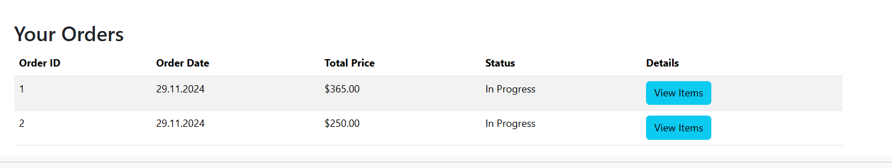
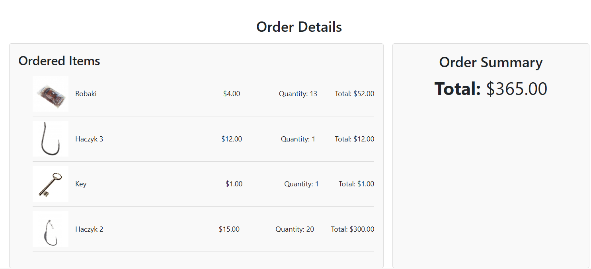
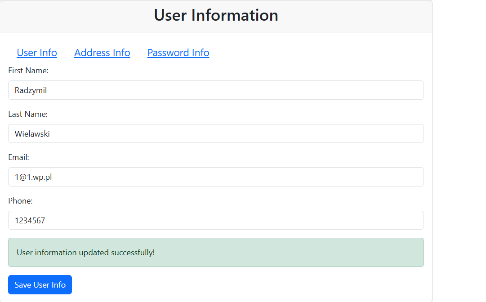
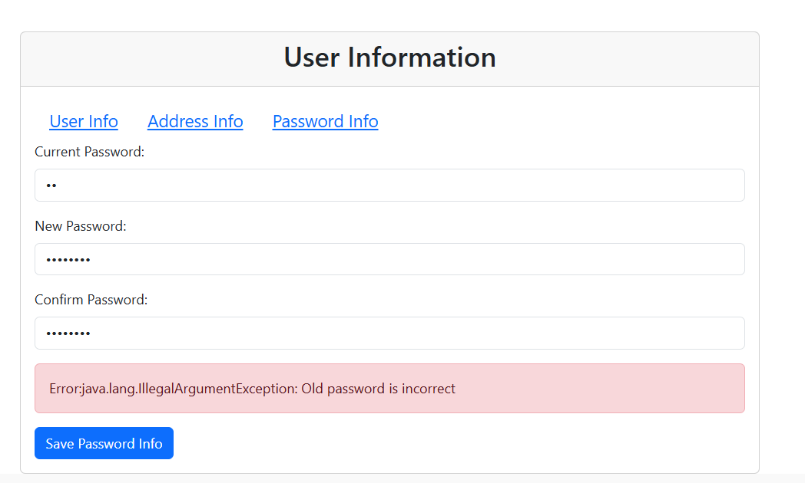

# Fish store

This is fishStore project done out of curiosity. The frontend was implemented in React and backend in SpringBoot.
Database diagram was designed by myself - database is in 3NF - PostgreSQL was used .
REST API was used for the communication between frontend and backend.

What was implemented:
- Admin panel (adding products, brands and types to the database) also during product adding  admin can add image of a product
- Main page (there are 2 products there, hotshot and recomended one, which are random products)
- Login + Registration + Authorization
- User info page (user can change his password, email, phone, name and adress info)
- Products page with pagination (on each page 20 products can be shown, products can be fetched by types too ex. rods, baits etc.)
- Cart + logic
- Order logic
- Orders info
- Layout (Carousel + Navbars)

# How to run
Project is divided on 2 parts (frontend and backend). The frontend is located in app/frontend directory and backend in app/src directory.

# First the database:
- connect to the PostgreSQL
- CREATE DATABASE my_database;
- GRANT CONNECT ON DATABASE {yourDataBase} TO {username};

# Requirments for backend:
For the project I used IntelliJ IDEA 2024.2.3 (Community Edition) with SDK: Oracle OpenJDK 23.0.1

How to build backend:

    - ensure that your project directory is a directory on which you can access assets and app
    - find app/pom.xml file --> right click build maven or / maven --> reload project
    - find app/src/main/resources/application.properties and specify:
        - your database ex. spring.datasource.url=jdbc:postgresql://localhost:{yourPort}/{yourDataBaseName}
        - username spring.datasource.username={yourUserName}
        - password  spring.datasource.password={yourPassword}
        - secretKey jwt.secret = {yourSecretKey} - has to be long enough
    - find run and execute it

# Frontend
How to build frontend:

    - cd app/frontend/fishstore directory
    - npm install (will install a dependencies stored in package.json)
    - npm run dev (can use production run too)

# Important
The frontend wants to talk with server, which is localhost:8080.
The backend wants frontend to be on localhost:5173 (important for authorization).

# Samples

# My environment
My building environment was: 

Edition	Windows 10 Education N
Version	22H2
Installed on	‎02/‎09/‎2021
OS build	19045.2965
Experience	Windows Feature Experience Pack 1000.19041.1000.0

# TO DO
 - searching for products using a bar
 - adding PUT/DELETE requests to the admin panel to change products informations
 - adding possibility for the administrator to change the user's data
 - including different roles than only administrator, user
 - adding warehouses, sectors
 - change password by sending code on a mail.
 